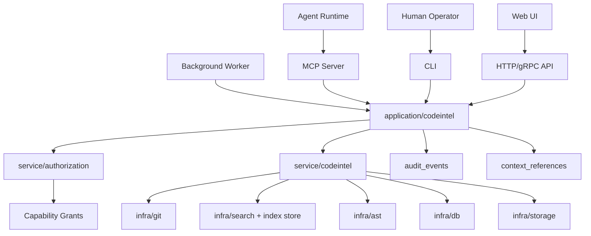
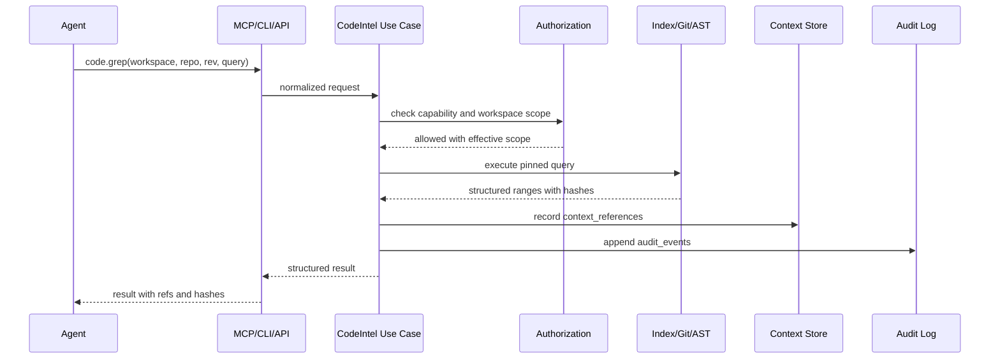
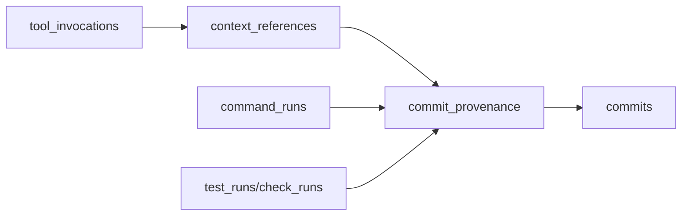
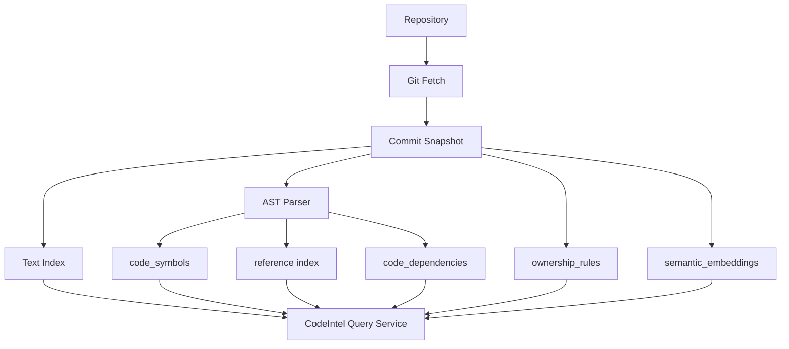

# Code Intelligence Primitives

## Goal

AgentHub should provide native code intelligence primitives as platform capabilities.

This is different from offering a nicer version of GitHub code search. The target user is an agent that needs trusted, permission-aware, commit-pinned, auditable context before it changes code.

Every code intelligence call should answer:

- Which workspace requested it
- Which agent and actor chain requested it
- Which repository, branch, commit, or snapshot it used
- Which capability allowed it
- Which files, symbols, ranges, and hashes were returned
- Whether the result became part of the agent's working context

## Design Principle

Code intelligence should behave like agent syscalls.

Agents can call the capability through MCP, CLI, HTTP/gRPC, or internal Go use cases, but all paths must route through the same authorization, provenance, audit, and context-recording layers.



## Exposure Surfaces

The primitive set should be exposed through multiple entrypoints.

### MCP

MCP is the primary agent-native interface.

Recommended tool names:

- `agenthub.code.grep`
- `agenthub.code.read_file`
- `agenthub.code.ast_query`
- `agenthub.code.symbols`
- `agenthub.code.references`
- `agenthub.code.dependencies`
- `agenthub.code.ownership`
- `agenthub.code.history`
- `agenthub.code.diff_map`
- `agenthub.code.test_discover`
- `agenthub.code.semantic_search`

MCP calls must require a workspace-scoped task token. They should not accept broad personal tokens by default.

### CLI

CLI is useful for local debugging, human operation, reproducible workflows, and CI.

Recommended command shape:

```text
agenthub code grep --workspace <id> --repo <repo> --rev <sha> --query "Authorize"
agenthub code read-file --workspace <id> --repo <repo> --rev <sha> --path internal/auth/service.go --start 20 --end 80
agenthub code symbols --workspace <id> --repo <repo> --rev <sha> --query AuthService
agenthub code references --workspace <id> --repo <repo> --rev <sha> --symbol AuthService.Authorize
agenthub code ownership --workspace <id> --repo <repo> --path internal/auth/service.go
```

CLI output should default to structured JSON. Human-readable output can be a flag, not the canonical format.

### HTTP/gRPC

HTTP/gRPC is for UI, external services, workers, and future SDKs.

Recommended API shape:

```text
POST /v1/workspaces/{workspace_id}/code/grep
POST /v1/workspaces/{workspace_id}/code/read-file
POST /v1/workspaces/{workspace_id}/code/ast-query
POST /v1/workspaces/{workspace_id}/code/symbols
POST /v1/workspaces/{workspace_id}/code/references
POST /v1/workspaces/{workspace_id}/code/dependencies
POST /v1/workspaces/{workspace_id}/code/ownership
POST /v1/workspaces/{workspace_id}/code/history
POST /v1/workspaces/{workspace_id}/code/diff-map
POST /v1/workspaces/{workspace_id}/code/test-discover
```

### Internal Go Use Cases

Internal callers should use `internal/application/codeintel`.

The application layer should expose use cases such as:

- `GrepCode`
- `ReadFile`
- `QueryAST`
- `FindSymbols`
- `FindReferences`
- `FindDependencies`
- `ResolveOwnership`
- `ExplainHistory`
- `MapDiff`
- `DiscoverTests`
- `SemanticSearch`

## Primitive Catalog

| Primitive | MVP | Purpose |
| --- | --- | --- |
| `code.grep` | Yes | Commit-pinned text search with path, language, and permission filtering |
| `code.read_file` | Yes | Read a specific file range from a repo revision or workspace snapshot |
| `code.symbols` | Yes | Find symbol definitions from an index |
| `code.references` | Yes | Find references to a symbol |
| `code.ownership` | Yes | Resolve owners, protected paths, and review requirements |
| `code.ast_query` | Later | Query AST structures such as imports, functions, methods, fields, and comments |
| `code.dependencies` | Later | Resolve dependency impact between symbols, files, packages, and repos |
| `code.history` | Later | Explain why a file range or symbol changed, with source refs |
| `code.diff_map` | Later | Map generated diffs back to exact file ranges and symbols |
| `code.test_discover` | Later | Infer relevant test commands and test files from changed paths and symbols |
| `code.semantic_search` | Later | Embedding-backed code, issue, PR, and memory search |

The MVP should prioritize correctness, provenance, and authorization over broad language coverage.

## MVP Definition

The first production-quality slice should include:

1. `code.grep`
2. `code.read_file`
3. `code.symbols`
4. `code.references`
5. `code.ownership`
6. MCP exposure
7. CLI exposure
8. HTTP/gRPC exposure
9. `context_references` records for every returned result used by an agent
10. `audit_events` and `tool_invocations` for every call

MVP language support:

- Go first
- Text search for all languages
- Symbol/reference extraction for Go first
- AST query for Go can be behind an experimental flag

## Request Flow



## Result Contract

All primitives should return structured results with stable source references.

Example:

```json
{
  "workspace_id": "7d6f5d5a-0dd4-4db0-8291-fbc3b4c1a5d8",
  "repo_id": "a4f2c6f0-8f2e-4a4e-98a7-bf98ed1f5d4c",
  "commit_sha": "3b4f0e9f2c8d8a2f9b6c1e7a0b1c2d3e4f5a6b7c",
  "primitive": "code.grep",
  "results": [
    {
      "ref_kind": "file_range",
      "file_path": "internal/service/authorization/service.go",
      "line_start": 42,
      "line_end": 67,
      "language": "go",
      "content_hash": "sha256:...",
      "symbol_refs": ["authorization.Service.Authorize"],
      "source": "grep",
      "context_reference_id": "c7a0c9e2-2780-4606-b3b6-9b8d6d87561e"
    }
  ]
}
```

Rules:

- Results must be tied to a commit SHA or immutable workspace snapshot.
- Results must include file paths and line ranges when code is returned.
- Large content should be stored as artifacts and referenced by URI plus hash.
- Secret redaction must happen before persistence and response serialization.
- Every returned code range that enters agent context should create a `context_references` row.

## Capability Model

Add code intelligence capabilities to the capability catalog.

Recommended capabilities:

- `code.grep`
- `code.read_file`
- `code.ast_query`
- `code.symbols`
- `code.references`
- `code.dependencies`
- `code.ownership`
- `code.history`
- `code.diff_map`
- `code.test_discover`
- `code.semantic_search`

Scopes:

- Org
- Repo
- Workspace
- Branch or commit
- Path glob
- Protected path
- Language

Default policy:

- Agents may only query repos bound to their workspace.
- Agents may only read paths allowed by workspace scope and capability grants.
- Protected paths can be discoverable by `code.ownership`, but content reads may require approval.
- Queries should be rate limited and result limited.
- Cross-repo code intelligence requires explicit workspace repo binding.

## Provenance And Audit

Every primitive call should produce:

- `tool_invocations` row
- `audit_events` row
- `context_references` rows for returned context used by the agent
- Optional `artifacts` rows for large result sets

Commit provenance should include references to context used during patch generation:



This lets reviewers inspect which code facts the agent used before producing a commit.

## Indexing Architecture



MVP indexing:

- Use Git plus ripgrep-compatible search for `code.grep`.
- Use Git object reads for `code.read_file`.
- Use Go parser/type information for Go `code.symbols` and `code.references`.
- Load ownership from explicit `ownership_rules` and provider files such as `CODEOWNERS`.

Later indexing:

- Tree-sitter for multi-language AST support.
- Dependency graph across packages and repos.
- Embedding search for code, issues, PRs, and memory.
- Incremental re-indexing from event bus changes.

## Go Package Mapping

Recommended packages:

```text
cmd/
  agenthub-cli/
  agenthub-mcp/
  agenthub-indexer/
internal/
  domain/codeintel/
  application/codeintel/
  service/codeintel/
  infra/ast/
  infra/git/
  infra/search/
  interfaces/cli/
  interfaces/mcp/
  interfaces/http/
  interfaces/grpc/
```

Responsibilities:

- `domain/codeintel`: request/result value objects, source refs, range hashes, primitive names
- `application/codeintel`: use cases, ports, transaction boundaries, context recording
- `service/codeintel`: query planning, result normalization, language dispatch, provenance helpers
- `infra/git`: commit-pinned file reads and diff reads
- `infra/search`: text index, embedding index, symbol/reference index storage
- `infra/ast`: Go AST parser first, tree-sitter later
- `interfaces/mcp`: MCP tool definitions and request mapping
- `interfaces/cli`: CLI command mapping and JSON output
- `interfaces/http` and `interfaces/grpc`: service API

## Review Integration

Review should display code intelligence evidence.

For each agent-generated PR, reviewers should be able to inspect:

- Search queries the agent ran
- Files and ranges the agent read
- Symbols and references considered
- Ownership results
- Test discovery results
- Context refs linked to each generated commit

This makes "why did the agent change this?" answerable from durable system records instead of chat memory.

