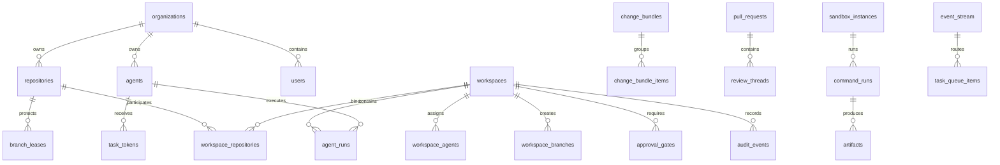

# Database Schema

## Database Choice

Use PostgreSQL as the primary system of record.

Recommended extensions:

- `pgcrypto` for `gen_random_uuid()`
- `citext` for case-insensitive slugs and email addresses
- `pg_trgm` for fuzzy text search where needed
- `vector` only if embeddings are stored directly in PostgreSQL

The first version should keep Git, database rows, audit logs, and artifacts as the source of truth. Semantic memory and generated summaries must reference those durable records instead of becoming independent facts.

## Conventions

Common columns:

```sql
id uuid primary key default gen_random_uuid()
created_at timestamptz not null default now()
updated_at timestamptz not null default now()
metadata jsonb not null default '{}'::jsonb
```

Use `text` plus application/domain validation for most status and type fields during early development. PostgreSQL enum types can be introduced later after workflows stabilize.

Use soft deletion only for user-facing resources that may need recovery. Audit, provenance, command logs, approvals, and security-sensitive events should be append-only.

## High-Level Entity Map



## Foundation Tables

### `organizations`

Represents an org or tenant.

| Column | Type | Notes |
| --- | --- | --- |
| `id` | `uuid` | Primary key |
| `slug` | `citext` | Unique public identifier |
| `name` | `text` | Display name |
| `status` | `text` | `active`, `suspended`, `deleted` |
| `settings` | `jsonb` | Org-level policy defaults |
| `created_at` | `timestamptz` |  |
| `updated_at` | `timestamptz` |  |

Indexes:

- `unique (slug)`

### `users`

Human identities.

| Column | Type | Notes |
| --- | --- | --- |
| `id` | `uuid` | Primary key |
| `org_id` | `uuid` | FK to `organizations.id` |
| `email` | `citext` | Login or notification email |
| `display_name` | `text` |  |
| `status` | `text` | `active`, `suspended`, `deleted` |
| `external_identity` | `jsonb` | SSO/GitHub identity refs |
| `created_at` | `timestamptz` |  |
| `updated_at` | `timestamptz` |  |

Indexes:

- `unique (org_id, email)`

### `teams`

Human team grouping for ownership and permission scope.

| Column | Type | Notes |
| --- | --- | --- |
| `id` | `uuid` | Primary key |
| `org_id` | `uuid` | FK to `organizations.id` |
| `slug` | `citext` | Unique inside org |
| `name` | `text` |  |
| `description` | `text` |  |
| `created_at` | `timestamptz` |  |
| `updated_at` | `timestamptz` |  |

Indexes:

- `unique (org_id, slug)`

### `team_members`

| Column | Type | Notes |
| --- | --- | --- |
| `team_id` | `uuid` | FK to `teams.id` |
| `user_id` | `uuid` | FK to `users.id` |
| `role` | `text` | `member`, `maintainer` |
| `created_at` | `timestamptz` |  |

Primary key:

- `(team_id, user_id)`

### `repositories`

Repository records controlled or mirrored by AgentHub.

| Column | Type | Notes |
| --- | --- | --- |
| `id` | `uuid` | Primary key |
| `org_id` | `uuid` | FK to `organizations.id` |
| `provider` | `text` | `agenthub`, `github`, `gitlab`, `local` |
| `external_id` | `text` | Provider repo id |
| `slug` | `citext` | Unique inside org |
| `name` | `text` |  |
| `default_branch` | `text` | Usually `main` |
| `clone_url` | `text` |  |
| `visibility` | `text` | `private`, `internal`, `public` |
| `status` | `text` | `active`, `archived`, `disabled` |
| `created_at` | `timestamptz` |  |
| `updated_at` | `timestamptz` |  |
| `metadata` | `jsonb` | Provider details |

Indexes:

- `unique (org_id, slug)`
- `unique (provider, external_id)` where `external_id is not null`

### `protected_paths`

Defines repo paths that need approval before agent modification.

| Column | Type | Notes |
| --- | --- | --- |
| `id` | `uuid` | Primary key |
| `repo_id` | `uuid` | FK to `repositories.id` |
| `path_glob` | `text` | Example: `migrations/**`, `.github/**` |
| `reason` | `text` |  |
| `required_gate_type` | `text` | Usually `protected_path.modify` |
| `created_by_user_id` | `uuid` | FK to `users.id` |
| `created_at` | `timestamptz` |  |
| `updated_at` | `timestamptz` |  |

Indexes:

- `(repo_id, path_glob)`

## Agent Identity And Capability Tables

### `agents`

First-class agent identities.

| Column | Type | Notes |
| --- | --- | --- |
| `id` | `uuid` | Primary key |
| `org_id` | `uuid` | FK to `organizations.id` |
| `slug` | `citext` | Unique inside org |
| `display_name` | `text` |  |
| `purpose` | `text` | Why this agent exists |
| `owner_user_id` | `uuid` | FK to `users.id` |
| `recovery_owner_user_id` | `uuid` | FK to `users.id` |
| `status` | `text` | `active`, `paused`, `revoked` |
| `default_model` | `text` | Optional model hint |
| `max_token_ttl_seconds` | `integer` | Upper bound for task token lifetime |
| `created_by_user_id` | `uuid` | FK to `users.id` |
| `created_at` | `timestamptz` |  |
| `updated_at` | `timestamptz` |  |
| `metadata` | `jsonb` | Agent profile details |

Indexes:

- `unique (org_id, slug)`
- `(org_id, owner_user_id)`

### `agent_human_bindings`

Records explicit human binding for an agent.

| Column | Type | Notes |
| --- | --- | --- |
| `id` | `uuid` | Primary key |
| `agent_id` | `uuid` | FK to `agents.id` |
| `user_id` | `uuid` | FK to `users.id` |
| `binding_type` | `text` | `owner`, `operator`, `recovery_owner`, `approver` |
| `status` | `text` | `active`, `revoked` |
| `created_at` | `timestamptz` |  |
| `revoked_at` | `timestamptz` | Nullable |

Indexes:

- `(agent_id, status)`
- `(user_id, status)`

### `capability_grants`

Fine-grained permission grants for agents, users, or teams.

| Column | Type | Notes |
| --- | --- | --- |
| `id` | `uuid` | Primary key |
| `org_id` | `uuid` | FK to `organizations.id` |
| `principal_kind` | `text` | `agent`, `user`, `team` |
| `principal_id` | `uuid` | ID in the principal table |
| `capability` | `text` | Example: `branch.create` |
| `effect` | `text` | `allow`, `deny` |
| `resource_kind` | `text` | `org`, `repo`, `workspace`, `path`, `branch` |
| `resource_id` | `uuid` | Nullable for org-wide grants |
| `repo_id` | `uuid` | Optional FK to `repositories.id` |
| `path_glob` | `text` | Optional path scope |
| `branch_pattern` | `text` | Optional branch scope, e.g. `agent/*` |
| `conditions` | `jsonb` | Time, network, approval, environment constraints |
| `expires_at` | `timestamptz` | Nullable |
| `created_by_user_id` | `uuid` | FK to `users.id` |
| `created_at` | `timestamptz` |  |
| `revoked_at` | `timestamptz` | Nullable |

Indexes:

- `(org_id, principal_kind, principal_id)`
- `(org_id, capability)`
- `(repo_id, capability)`

### `task_tokens`

Short-lived credentials issued to an agent for a workspace.

Store only token hashes, never plaintext tokens.

| Column | Type | Notes |
| --- | --- | --- |
| `id` | `uuid` | Primary key |
| `org_id` | `uuid` | FK to `organizations.id` |
| `workspace_id` | `uuid` | FK to `workspaces.id` |
| `agent_id` | `uuid` | FK to `agents.id` |
| `issued_by_user_id` | `uuid` | FK to `users.id` |
| `token_hash` | `text` | Unique hash |
| `scope` | `jsonb` | Effective capabilities and resource scope |
| `actor_chain_id` | `uuid` | FK to `actor_chains.id` |
| `expires_at` | `timestamptz` | Required |
| `last_used_at` | `timestamptz` | Nullable |
| `revoked_at` | `timestamptz` | Nullable |
| `created_at` | `timestamptz` |  |

Indexes:

- `unique (token_hash)`
- `(workspace_id, agent_id)`
- `(expires_at)` where `revoked_at is null`

### `actor_chains`

Immutable actor chain records.

| Column | Type | Notes |
| --- | --- | --- |
| `id` | `uuid` | Primary key |
| `org_id` | `uuid` | FK to `organizations.id` |
| `workspace_id` | `uuid` | Nullable FK to `workspaces.id` |
| `root_user_id` | `uuid` | FK to `users.id` |
| `agent_id` | `uuid` | Nullable FK to `agents.id` |
| `task_token_id` | `uuid` | Nullable FK to `task_tokens.id` |
| `chain` | `jsonb` | Ordered actor chain snapshot |
| `created_at` | `timestamptz` |  |

Indexes:

- `(workspace_id, created_at)`
- `(agent_id, created_at)`

## Workspace And Task Tables

### `workspaces`

The main task primitive.

| Column | Type | Notes |
| --- | --- | --- |
| `id` | `uuid` | Primary key |
| `org_id` | `uuid` | FK to `organizations.id` |
| `key` | `text` | Human readable task key |
| `title` | `text` |  |
| `description` | `text` | Requirement summary |
| `requirement_kind` | `text` | `issue`, `incident`, `manual`, `api` |
| `requirement_ref` | `text` | External issue URL/id |
| `status` | `text` | `created`, `running`, `waiting_approval`, `blocked`, `completed`, `cancelled` |
| `approval_state` | `text` | `none`, `pending`, `approved`, `denied`, `expired` |
| `created_by_user_id` | `uuid` | FK to `users.id` |
| `primary_agent_id` | `uuid` | Nullable FK to `agents.id` |
| `sandbox_policy_id` | `uuid` | Nullable FK to `sandbox_policies.id` |
| `memory_scope` | `jsonb` | Which memory scopes are allowed |
| `created_at` | `timestamptz` |  |
| `updated_at` | `timestamptz` |  |
| `closed_at` | `timestamptz` | Nullable |
| `metadata` | `jsonb` |  |

Indexes:

- `unique (org_id, key)`
- `(org_id, status, updated_at)`
- `(primary_agent_id, status)`

### `workspace_repositories`

Repos bound to a workspace.

| Column | Type | Notes |
| --- | --- | --- |
| `workspace_id` | `uuid` | FK to `workspaces.id` |
| `repo_id` | `uuid` | FK to `repositories.id` |
| `role` | `text` | `primary`, `dependency`, `generated`, `readonly` |
| `base_branch` | `text` | Branch to start from |
| `target_branch` | `text` | Branch PR should merge into |
| `created_at` | `timestamptz` |  |

Primary key:

- `(workspace_id, repo_id)`

Indexes:

- `(repo_id, workspace_id)`

### `workspace_agents`

Agents assigned to a workspace.

| Column | Type | Notes |
| --- | --- | --- |
| `workspace_id` | `uuid` | FK to `workspaces.id` |
| `agent_id` | `uuid` | FK to `agents.id` |
| `role` | `text` | `coordinator`, `implementer`, `reviewer`, `fixer` |
| `status` | `text` | `assigned`, `active`, `paused`, `done` |
| `assigned_by_user_id` | `uuid` | FK to `users.id` |
| `created_at` | `timestamptz` |  |
| `updated_at` | `timestamptz` |  |

Primary key:

- `(workspace_id, agent_id, role)`

### `workspace_branches`

Branches produced or managed for a workspace.

| Column | Type | Notes |
| --- | --- | --- |
| `id` | `uuid` | Primary key |
| `workspace_id` | `uuid` | FK to `workspaces.id` |
| `repo_id` | `uuid` | FK to `repositories.id` |
| `branch_name` | `text` | Usually `agent/{workspace-key}` |
| `base_branch` | `text` |  |
| `base_sha` | `text` |  |
| `head_sha` | `text` | Nullable until pushed |
| `status` | `text` | `planned`, `created`, `pushed`, `stale`, `merged`, `deleted` |
| `created_by_agent_id` | `uuid` | FK to `agents.id` |
| `created_at` | `timestamptz` |  |
| `updated_at` | `timestamptz` |  |

Indexes:

- `unique (repo_id, branch_name)`
- `(workspace_id, repo_id)`

### `workspace_snapshots`

Durable state snapshots for resume and audit.

| Column | Type | Notes |
| --- | --- | --- |
| `id` | `uuid` | Primary key |
| `workspace_id` | `uuid` | FK to `workspaces.id` |
| `snapshot_kind` | `text` | `filesystem`, `state`, `memory`, `context` |
| `storage_uri` | `text` | Object storage path |
| `content_hash` | `text` | Hash of snapshot payload |
| `created_by_agent_id` | `uuid` | Nullable FK to `agents.id` |
| `created_at` | `timestamptz` |  |
| `metadata` | `jsonb` |  |

Indexes:

- `(workspace_id, snapshot_kind, created_at)`

## Branch And Change Orchestration Tables

### `branch_leases`

Prevents concurrent agents from colliding on the same branch or area.

| Column | Type | Notes |
| --- | --- | --- |
| `id` | `uuid` | Primary key |
| `org_id` | `uuid` | FK to `organizations.id` |
| `workspace_id` | `uuid` | FK to `workspaces.id` |
| `repo_id` | `uuid` | FK to `repositories.id` |
| `branch_name` | `text` |  |
| `lease_kind` | `text` | `branch`, `file_area`, `symbol_area` |
| `holder_agent_id` | `uuid` | FK to `agents.id` |
| `fencing_token` | `bigint` | Monotonic token for stale holder protection |
| `status` | `text` | `active`, `released`, `expired`, `stolen` |
| `acquired_at` | `timestamptz` |  |
| `expires_at` | `timestamptz` |  |
| `released_at` | `timestamptz` | Nullable |
| `metadata` | `jsonb` | Optional path/symbol scope |

Critical constraint:

```sql
create unique index branch_leases_one_active_branch
on branch_leases (repo_id, branch_name)
where status = 'active';
```

### `change_bundles`

Groups related changes across one or more repos.

| Column | Type | Notes |
| --- | --- | --- |
| `id` | `uuid` | Primary key |
| `org_id` | `uuid` | FK to `organizations.id` |
| `workspace_id` | `uuid` | FK to `workspaces.id` |
| `title` | `text` |  |
| `status` | `text` | `draft`, `ready_for_review`, `approved`, `merged`, `reverted`, `cancelled` |
| `risk_level` | `text` | `low`, `medium`, `high`, `critical` |
| `created_by_agent_id` | `uuid` | FK to `agents.id` |
| `rollback_plan` | `jsonb` | Generated rollback plan |
| `created_at` | `timestamptz` |  |
| `updated_at` | `timestamptz` |  |
| `metadata` | `jsonb` |  |

Indexes:

- `(workspace_id, status)`

### `change_bundle_items`

Repos, branches, commits, or PRs inside a bundle.

| Column | Type | Notes |
| --- | --- | --- |
| `id` | `uuid` | Primary key |
| `bundle_id` | `uuid` | FK to `change_bundles.id` |
| `repo_id` | `uuid` | FK to `repositories.id` |
| `workspace_branch_id` | `uuid` | FK to `workspace_branches.id` |
| `pull_request_id` | `uuid` | Nullable FK to `pull_requests.id` |
| `merge_order` | `integer` | Cross-repo merge order |
| `status` | `text` | `draft`, `ready`, `blocked`, `merged`, `reverted` |
| `created_at` | `timestamptz` |  |
| `updated_at` | `timestamptz` |  |

Indexes:

- `(bundle_id, merge_order)`
- `(repo_id, status)`

### `commits`

Known commits produced or tracked by AgentHub.

| Column | Type | Notes |
| --- | --- | --- |
| `id` | `uuid` | Primary key |
| `org_id` | `uuid` | FK to `organizations.id` |
| `repo_id` | `uuid` | FK to `repositories.id` |
| `workspace_id` | `uuid` | Nullable FK to `workspaces.id` |
| `bundle_id` | `uuid` | Nullable FK to `change_bundles.id` |
| `sha` | `text` | Git commit SHA |
| `message` | `text` | Commit message |
| `parent_shas` | `jsonb` | Parent commit SHAs |
| `author_agent_id` | `uuid` | Nullable FK to `agents.id` |
| `author_user_id` | `uuid` | Nullable FK to `users.id` |
| `committed_at` | `timestamptz` |  |
| `created_at` | `timestamptz` |  |

Indexes:

- `unique (repo_id, sha)`
- `(workspace_id, committed_at)`
- `(bundle_id, committed_at)`

### `commit_provenance`

Provenance record for agent-generated commits.

| Column | Type | Notes |
| --- | --- | --- |
| `commit_id` | `uuid` | PK, FK to `commits.id` |
| `workspace_id` | `uuid` | FK to `workspaces.id` |
| `agent_run_id` | `uuid` | FK to `agent_runs.id` |
| `actor_chain_id` | `uuid` | FK to `actor_chains.id` |
| `prompt_hash` | `text` | Hash of instruction prompt |
| `context_hash` | `text` | Hash of retrieved context |
| `diff_hash` | `text` | Hash of patch/diff |
| `tool_log_refs` | `jsonb` | Tool invocation refs |
| `test_evidence_refs` | `jsonb` | Test/check/artifact refs |
| `created_at` | `timestamptz` |  |
| `payload` | `jsonb` | Extra signed provenance payload |

Indexes:

- `(workspace_id, created_at)`
- `(actor_chain_id)`

### `revert_plans`

Generated revert or rollback plans.

| Column | Type | Notes |
| --- | --- | --- |
| `id` | `uuid` | Primary key |
| `bundle_id` | `uuid` | Nullable FK to `change_bundles.id` |
| `commit_id` | `uuid` | Nullable FK to `commits.id` |
| `plan_kind` | `text` | `revert_commit`, `rollback_migration`, `manual_steps` |
| `plan` | `jsonb` | Ordered rollback steps |
| `status` | `text` | `draft`, `approved`, `executed`, `invalidated` |
| `generated_by_agent_id` | `uuid` | FK to `agents.id` |
| `created_at` | `timestamptz` |  |
| `updated_at` | `timestamptz` |  |

## Agent Run And Sandbox Tables

### `agent_runs`

One resumable execution loop for an agent inside a workspace.

| Column | Type | Notes |
| --- | --- | --- |
| `id` | `uuid` | Primary key |
| `workspace_id` | `uuid` | FK to `workspaces.id` |
| `agent_id` | `uuid` | FK to `agents.id` |
| `task_token_id` | `uuid` | FK to `task_tokens.id` |
| `actor_chain_id` | `uuid` | FK to `actor_chains.id` |
| `status` | `text` | `queued`, `running`, `waiting_approval`, `failed`, `completed`, `cancelled` |
| `resume_from_run_id` | `uuid` | Nullable FK to `agent_runs.id` |
| `model` | `text` | Model used by agent |
| `input_context_hash` | `text` | Hash of initial context |
| `final_summary_ref` | `text` | Artifact or memory ref |
| `started_at` | `timestamptz` | Nullable |
| `finished_at` | `timestamptz` | Nullable |
| `created_at` | `timestamptz` |  |
| `metadata` | `jsonb` |  |

Indexes:

- `(workspace_id, status, created_at)`
- `(agent_id, status)`

### `sandbox_policies`

Reusable runtime policy.

| Column | Type | Notes |
| --- | --- | --- |
| `id` | `uuid` | Primary key |
| `org_id` | `uuid` | FK to `organizations.id` |
| `name` | `text` |  |
| `network_policy` | `jsonb` | Deny by default |
| `secret_policy` | `jsonb` | Deny by default |
| `filesystem_policy` | `jsonb` | Mounts and write scope |
| `privilege_policy` | `jsonb` | sudo, docker, host access |
| `created_by_user_id` | `uuid` | FK to `users.id` |
| `created_at` | `timestamptz` |  |
| `updated_at` | `timestamptz` |  |

Indexes:

- `unique (org_id, name)`

### `sandbox_instances`

Concrete per-task runtime.

| Column | Type | Notes |
| --- | --- | --- |
| `id` | `uuid` | Primary key |
| `workspace_id` | `uuid` | FK to `workspaces.id` |
| `agent_run_id` | `uuid` | Nullable FK to `agent_runs.id` |
| `policy_id` | `uuid` | FK to `sandbox_policies.id` |
| `runner_id` | `text` | Physical/logical runner |
| `image_ref` | `text` | Container image or devbox ref |
| `status` | `text` | `creating`, `running`, `paused`, `stopped`, `failed` |
| `initial_snapshot_id` | `uuid` | Nullable FK to `workspace_snapshots.id` |
| `current_snapshot_id` | `uuid` | Nullable FK to `workspace_snapshots.id` |
| `started_at` | `timestamptz` | Nullable |
| `stopped_at` | `timestamptz` | Nullable |
| `created_at` | `timestamptz` |  |
| `metadata` | `jsonb` | Runtime details |

Indexes:

- `(workspace_id, status)`
- `(agent_run_id)`

### `tool_invocations`

Agent tool calls, including Git operations and command runner calls.

| Column | Type | Notes |
| --- | --- | --- |
| `id` | `uuid` | Primary key |
| `workspace_id` | `uuid` | FK to `workspaces.id` |
| `agent_run_id` | `uuid` | FK to `agent_runs.id` |
| `agent_id` | `uuid` | FK to `agents.id` |
| `actor_chain_id` | `uuid` | FK to `actor_chains.id` |
| `tool_name` | `text` | Example: `git.push`, `shell.exec` |
| `tool_type` | `text` | `git`, `shell`, `search`, `github`, `sandbox` |
| `input_hash` | `text` | Hash of full input |
| `input_redacted` | `jsonb` | Redacted input |
| `status` | `text` | `started`, `succeeded`, `failed`, `cancelled` |
| `started_at` | `timestamptz` |  |
| `finished_at` | `timestamptz` | Nullable |
| `output_ref` | `text` | Artifact/log ref |
| `error` | `text` | Nullable |
| `metadata` | `jsonb` |  |

Indexes:

- `(workspace_id, started_at)`
- `(agent_run_id, started_at)`
- `(tool_name, status)`

### `command_runs`

Audited shell/process executions.

| Column | Type | Notes |
| --- | --- | --- |
| `id` | `uuid` | Primary key |
| `workspace_id` | `uuid` | FK to `workspaces.id` |
| `sandbox_id` | `uuid` | FK to `sandbox_instances.id` |
| `tool_invocation_id` | `uuid` | FK to `tool_invocations.id` |
| `command` | `text` | Executable |
| `args` | `jsonb` | Arguments |
| `cwd` | `text` | Working directory |
| `env_hash` | `text` | Hash of environment |
| `network_allowed` | `boolean` | Effective policy |
| `secrets_allowed` | `boolean` | Effective policy |
| `privileged` | `boolean` | Effective policy |
| `status` | `text` | `queued`, `running`, `succeeded`, `failed`, `cancelled`, `timed_out` |
| `exit_code` | `integer` | Nullable until finished |
| `stdout_uri` | `text` | Object storage/log ref |
| `stderr_uri` | `text` | Object storage/log ref |
| `started_at` | `timestamptz` | Nullable |
| `finished_at` | `timestamptz` | Nullable |
| `created_at` | `timestamptz` |  |
| `metadata` | `jsonb` |  |

Indexes:

- `(workspace_id, created_at)`
- `(sandbox_id, created_at)`
- `(status, created_at)`

### `artifacts`

Files produced by commands, checks, indexers, or agents.

| Column | Type | Notes |
| --- | --- | --- |
| `id` | `uuid` | Primary key |
| `org_id` | `uuid` | FK to `organizations.id` |
| `workspace_id` | `uuid` | Nullable FK to `workspaces.id` |
| `produced_by_command_id` | `uuid` | Nullable FK to `command_runs.id` |
| `produced_by_check_run_id` | `uuid` | Nullable FK to `check_runs.id` |
| `artifact_kind` | `text` | `log`, `patch`, `snapshot`, `test_report`, `index`, `summary` |
| `name` | `text` |  |
| `storage_uri` | `text` | Object storage path |
| `content_hash` | `text` |  |
| `size_bytes` | `bigint` |  |
| `mime_type` | `text` |  |
| `created_at` | `timestamptz` |  |
| `metadata` | `jsonb` |  |

Indexes:

- `(workspace_id, artifact_kind, created_at)`
- `(content_hash)`

## Approval Tables

### `approval_gates`

Pending or completed approval requests.

| Column | Type | Notes |
| --- | --- | --- |
| `id` | `uuid` | Primary key |
| `org_id` | `uuid` | FK to `organizations.id` |
| `workspace_id` | `uuid` | FK to `workspaces.id` |
| `gate_type` | `text` | `before_push`, `open_pr`, `protected_path`, `network`, `secret`, `merge`, `cross_repo` |
| `action` | `text` | Precise action requested |
| `resource_kind` | `text` | `repo`, `branch`, `path`, `command`, `secret`, `bundle` |
| `resource_id` | `uuid` | Nullable |
| `requested_by_agent_id` | `uuid` | Nullable FK to `agents.id` |
| `requested_by_user_id` | `uuid` | Nullable FK to `users.id` |
| `status` | `text` | `pending`, `approved`, `denied`, `expired`, `cancelled`, `used` |
| `context_hash` | `text` | Hash of approval context |
| `diff_hash` | `text` | Hash of relevant diff, if any |
| `context_artifact_id` | `uuid` | Nullable FK to `artifacts.id` |
| `expires_at` | `timestamptz` | Nullable |
| `created_at` | `timestamptz` |  |
| `updated_at` | `timestamptz` |  |
| `metadata` | `jsonb` |  |

Indexes:

- `(workspace_id, status, created_at)`
- `(gate_type, status)`

### `approval_decisions`

Append-only approval decisions.

| Column | Type | Notes |
| --- | --- | --- |
| `id` | `uuid` | Primary key |
| `gate_id` | `uuid` | FK to `approval_gates.id` |
| `decision` | `text` | `approved`, `denied`, `revoked` |
| `decided_by_user_id` | `uuid` | FK to `users.id` |
| `decided_at` | `timestamptz` |  |
| `approved_context_hash` | `text` | What exactly was approved |
| `comment` | `text` | Nullable |
| `metadata` | `jsonb` |  |

Indexes:

- `(gate_id, decided_at)`
- `(decided_by_user_id, decided_at)`

## Review Tables

### `pull_requests`

Internal mirror of PRs opened by AgentHub or external providers.

| Column | Type | Notes |
| --- | --- | --- |
| `id` | `uuid` | Primary key |
| `org_id` | `uuid` | FK to `organizations.id` |
| `repo_id` | `uuid` | FK to `repositories.id` |
| `workspace_id` | `uuid` | Nullable FK to `workspaces.id` |
| `bundle_id` | `uuid` | Nullable FK to `change_bundles.id` |
| `provider` | `text` | `agenthub`, `github`, `gitlab` |
| `external_id` | `text` | Provider PR id |
| `number` | `integer` | Provider PR number |
| `title` | `text` |  |
| `body` | `text` |  |
| `url` | `text` |  |
| `base_branch` | `text` |  |
| `head_branch` | `text` |  |
| `status` | `text` | `draft`, `open`, `merged`, `closed` |
| `opened_by_agent_id` | `uuid` | Nullable FK to `agents.id` |
| `opened_by_user_id` | `uuid` | Nullable FK to `users.id` |
| `opened_at` | `timestamptz` | Nullable |
| `merged_at` | `timestamptz` | Nullable |
| `created_at` | `timestamptz` |  |
| `updated_at` | `timestamptz` |  |
| `metadata` | `jsonb` |  |

Indexes:

- `unique (provider, external_id)` where `external_id is not null`
- `(repo_id, number)`
- `(workspace_id, status)`

### `review_evidence`

Required evidence attached to a PR or workspace.

| Column | Type | Notes |
| --- | --- | --- |
| `id` | `uuid` | Primary key |
| `workspace_id` | `uuid` | FK to `workspaces.id` |
| `pull_request_id` | `uuid` | Nullable FK to `pull_requests.id` |
| `evidence_kind` | `text` | `self_checklist`, `tests_run`, `files_touched`, `risk_summary`, `diff_summary` |
| `payload` | `jsonb` | Structured evidence |
| `artifact_id` | `uuid` | Nullable FK to `artifacts.id` |
| `created_by_agent_id` | `uuid` | Nullable FK to `agents.id` |
| `created_at` | `timestamptz` |  |

Indexes:

- `(workspace_id, evidence_kind, created_at)`
- `(pull_request_id, evidence_kind)`

### `review_threads`

Inline review threads assignable to humans or agents.

| Column | Type | Notes |
| --- | --- | --- |
| `id` | `uuid` | Primary key |
| `org_id` | `uuid` | FK to `organizations.id` |
| `pull_request_id` | `uuid` | FK to `pull_requests.id` |
| `external_thread_id` | `text` | Provider review thread id |
| `file_path` | `text` | Nullable for general threads |
| `line_start` | `integer` | Nullable |
| `line_end` | `integer` | Nullable |
| `body` | `text` | Latest thread body/summary |
| `status` | `text` | `open`, `assigned`, `fixed`, `resolved`, `wontfix` |
| `assigned_agent_id` | `uuid` | Nullable FK to `agents.id` |
| `assigned_user_id` | `uuid` | Nullable FK to `users.id` |
| `intent_approved` | `boolean` | Reviewer approved intent |
| `regenerate_patch_required` | `boolean` | Requires agent to regenerate patch |
| `created_at` | `timestamptz` |  |
| `updated_at` | `timestamptz` |  |
| `metadata` | `jsonb` |  |

Indexes:

- `(pull_request_id, status)`
- `(assigned_agent_id, status)`
- `(file_path)`

### `review_actions`

Append-only action log for review threads.

| Column | Type | Notes |
| --- | --- | --- |
| `id` | `uuid` | Primary key |
| `review_thread_id` | `uuid` | FK to `review_threads.id` |
| `actor_kind` | `text` | `user`, `agent`, `system` |
| `actor_id` | `uuid` | Nullable for system |
| `action` | `text` | `assign`, `comment`, `fix_started`, `fix_submitted`, `resolve`, `reopen` |
| `payload` | `jsonb` |  |
| `created_at` | `timestamptz` |  |

Indexes:

- `(review_thread_id, created_at)`

### `diff_explanations`

Agent-generated explanations tied to exact code ranges.

| Column | Type | Notes |
| --- | --- | --- |
| `id` | `uuid` | Primary key |
| `pull_request_id` | `uuid` | FK to `pull_requests.id` |
| `file_path` | `text` |  |
| `line_start` | `integer` |  |
| `line_end` | `integer` |  |
| `explanation` | `text` |  |
| `source_refs` | `jsonb` | Commits, tool logs, symbols, memory refs |
| `generated_by_agent_id` | `uuid` | FK to `agents.id` |
| `created_at` | `timestamptz` |  |

Indexes:

- `(pull_request_id, file_path, line_start)`

## Event Bus Tables

### `agent_hooks`

Subscriptions from event types to agent queues.

| Column | Type | Notes |
| --- | --- | --- |
| `id` | `uuid` | Primary key |
| `org_id` | `uuid` | FK to `organizations.id` |
| `agent_id` | `uuid` | FK to `agents.id` |
| `event_type` | `text` | Example: `review.comment.assigned` |
| `filter` | `jsonb` | Repo/team/path/status filter |
| `enabled` | `boolean` |  |
| `created_at` | `timestamptz` |  |
| `updated_at` | `timestamptz` |  |

Indexes:

- `(org_id, event_type, enabled)`
- `(agent_id, enabled)`

### `event_stream`

Durable event log for agent hooks and background jobs.

| Column | Type | Notes |
| --- | --- | --- |
| `id` | `uuid` | Primary key |
| `org_id` | `uuid` | FK to `organizations.id` |
| `workspace_id` | `uuid` | Nullable FK to `workspaces.id` |
| `event_type` | `text` |  |
| `source_kind` | `text` | `github`, `ci`, `agenthub`, `scheduler`, `incident` |
| `source_id` | `text` | External or internal source id |
| `payload` | `jsonb` | Event payload |
| `trace_id` | `text` | Distributed trace/correlation id |
| `status` | `text` | `new`, `queued`, `processed`, `failed`, `dead_lettered` |
| `available_at` | `timestamptz` | For delayed processing |
| `attempts` | `integer` |  |
| `created_at` | `timestamptz` |  |
| `updated_at` | `timestamptz` |  |

Indexes:

- `(status, available_at)`
- `(workspace_id, created_at)`
- `(event_type, created_at)`
- `(trace_id)`

### `task_queue_items`

Concrete queue items assigned to agents or workers.

| Column | Type | Notes |
| --- | --- | --- |
| `id` | `uuid` | Primary key |
| `event_id` | `uuid` | FK to `event_stream.id` |
| `workspace_id` | `uuid` | Nullable FK to `workspaces.id` |
| `assigned_agent_id` | `uuid` | Nullable FK to `agents.id` |
| `queue_name` | `text` |  |
| `priority` | `integer` | Higher first |
| `status` | `text` | `queued`, `claimed`, `running`, `done`, `failed`, `dead_lettered` |
| `claimed_by` | `text` | Worker id |
| `claimed_at` | `timestamptz` | Nullable |
| `available_at` | `timestamptz` |  |
| `attempts` | `integer` |  |
| `created_at` | `timestamptz` |  |
| `updated_at` | `timestamptz` |  |

Indexes:

- `(queue_name, status, priority desc, available_at)`
- `(assigned_agent_id, status)`

## Durable Conversation And Memory Tables

### `conversation_messages`

Durable task conversation and reasoning log.

| Column | Type | Notes |
| --- | --- | --- |
| `id` | `uuid` | Primary key |
| `workspace_id` | `uuid` | FK to `workspaces.id` |
| `agent_run_id` | `uuid` | Nullable FK to `agent_runs.id` |
| `actor_kind` | `text` | `user`, `agent`, `system`, `tool` |
| `actor_id` | `uuid` | Nullable |
| `message_kind` | `text` | `intent`, `plan`, `observation`, `failure`, `summary`, `final` |
| `content` | `text` | Redacted content safe for display |
| `raw_artifact_id` | `uuid` | Nullable FK to `artifacts.id` |
| `created_at` | `timestamptz` |  |
| `metadata` | `jsonb` |  |

Indexes:

- `(workspace_id, created_at)`
- `(agent_run_id, created_at)`

### `memory_entries`

Scoped memory with source references.

| Column | Type | Notes |
| --- | --- | --- |
| `id` | `uuid` | Primary key |
| `org_id` | `uuid` | FK to `organizations.id` |
| `scope_kind` | `text` | `org`, `repo`, `workspace`, `agent` |
| `scope_id` | `uuid` | Scope object id |
| `repo_id` | `uuid` | Nullable FK to `repositories.id` |
| `workspace_id` | `uuid` | Nullable FK to `workspaces.id` |
| `agent_id` | `uuid` | Nullable FK to `agents.id` |
| `memory_kind` | `text` | `summary`, `preference`, `decision`, `finding`, `failure` |
| `content` | `text` | Human-readable memory |
| `source_refs` | `jsonb` | Git/DB/log/artifact refs |
| `confidence` | `numeric(5,4)` | Optional confidence score |
| `created_by_agent_id` | `uuid` | Nullable FK to `agents.id` |
| `superseded_by_id` | `uuid` | Nullable FK to `memory_entries.id` |
| `created_at` | `timestamptz` |  |
| `metadata` | `jsonb` |  |

Indexes:

- `(org_id, scope_kind, scope_id, created_at)`
- `(repo_id, memory_kind)`
- `(workspace_id, created_at)`

### `context_references`

Records code search and context retrieval results used by agents.

| Column | Type | Notes |
| --- | --- | --- |
| `id` | `uuid` | Primary key |
| `workspace_id` | `uuid` | FK to `workspaces.id` |
| `agent_run_id` | `uuid` | FK to `agent_runs.id` |
| `ref_kind` | `text` | `file`, `symbol`, `commit`, `issue`, `pr`, `memory`, `artifact` |
| `ref_id` | `text` | External or internal id |
| `repo_id` | `uuid` | Nullable FK to `repositories.id` |
| `file_path` | `text` | Nullable |
| `line_start` | `integer` | Nullable |
| `line_end` | `integer` | Nullable |
| `content_hash` | `text` | Hash of retrieved content |
| `rank` | `integer` | Retrieval rank |
| `created_at` | `timestamptz` |  |
| `metadata` | `jsonb` |  |

Indexes:

- `(workspace_id, created_at)`
- `(agent_run_id, rank)`
- `(repo_id, file_path)`

## Semantic Code Context Tables

### `repo_indexes`

Index build metadata per repo and commit.

| Column | Type | Notes |
| --- | --- | --- |
| `id` | `uuid` | Primary key |
| `repo_id` | `uuid` | FK to `repositories.id` |
| `commit_sha` | `text` | Indexed commit |
| `index_kind` | `text` | `symbols`, `dependencies`, `embeddings`, `ownership` |
| `status` | `text` | `queued`, `running`, `ready`, `failed`, `stale` |
| `artifact_id` | `uuid` | Nullable FK to `artifacts.id` |
| `started_at` | `timestamptz` | Nullable |
| `finished_at` | `timestamptz` | Nullable |
| `created_at` | `timestamptz` |  |
| `metadata` | `jsonb` |  |

Indexes:

- `(repo_id, commit_sha, index_kind)`
- `(status, created_at)`

### `code_symbols`

Symbol index.

| Column | Type | Notes |
| --- | --- | --- |
| `id` | `uuid` | Primary key |
| `repo_id` | `uuid` | FK to `repositories.id` |
| `commit_sha` | `text` |  |
| `language` | `text` |  |
| `symbol_kind` | `text` | `function`, `method`, `type`, `variable`, `package` |
| `name` | `text` |  |
| `qualified_name` | `text` |  |
| `file_path` | `text` |  |
| `line_start` | `integer` |  |
| `line_end` | `integer` |  |
| `signature_hash` | `text` |  |
| `metadata` | `jsonb` |  |
| `created_at` | `timestamptz` |  |

Indexes:

- `(repo_id, commit_sha, qualified_name)`
- `(repo_id, file_path)`
- `gin (qualified_name gin_trgm_ops)`

### `code_dependencies`

Dependency graph between symbols, files, packages, or repos.

| Column | Type | Notes |
| --- | --- | --- |
| `id` | `uuid` | Primary key |
| `repo_id` | `uuid` | FK to `repositories.id` |
| `commit_sha` | `text` |  |
| `from_kind` | `text` | `symbol`, `file`, `package`, `repo` |
| `from_ref` | `text` |  |
| `to_kind` | `text` | `symbol`, `file`, `package`, `repo` |
| `to_ref` | `text` |  |
| `dependency_kind` | `text` | `imports`, `calls`, `implements`, `owns`, `generates` |
| `metadata` | `jsonb` |  |
| `created_at` | `timestamptz` |  |

Indexes:

- `(repo_id, commit_sha, from_kind, from_ref)`
- `(repo_id, commit_sha, to_kind, to_ref)`

### `ownership_rules`

Code ownership and review requirements.

| Column | Type | Notes |
| --- | --- | --- |
| `id` | `uuid` | Primary key |
| `repo_id` | `uuid` | FK to `repositories.id` |
| `path_glob` | `text` |  |
| `owner_kind` | `text` | `user`, `team`, `agent` |
| `owner_id` | `uuid` |  |
| `required_review_count` | `integer` |  |
| `requires_human_review` | `boolean` |  |
| `created_at` | `timestamptz` |  |
| `updated_at` | `timestamptz` |  |
| `metadata` | `jsonb` |  |

Indexes:

- `(repo_id, path_glob)`
- `(owner_kind, owner_id)`

### `semantic_embeddings`

Embedding index metadata. Store vectors in this table only if using `pgvector`; otherwise store `vector_ref`.

| Column | Type | Notes |
| --- | --- | --- |
| `id` | `uuid` | Primary key |
| `org_id` | `uuid` | FK to `organizations.id` |
| `repo_id` | `uuid` | Nullable FK to `repositories.id` |
| `subject_kind` | `text` | `file`, `symbol`, `issue`, `pr`, `memory`, `artifact` |
| `subject_id` | `text` |  |
| `content_hash` | `text` |  |
| `embedding_model` | `text` |  |
| `embedding` | `vector` | Optional if using pgvector |
| `vector_ref` | `text` | Optional external vector DB ref |
| `created_at` | `timestamptz` |  |
| `metadata` | `jsonb` |  |

Indexes:

- `(org_id, subject_kind, subject_id)`
- `(repo_id, content_hash)`

### `code_xrefs`

Cross references between issues, PRs, commits, files, symbols, and memories.

| Column | Type | Notes |
| --- | --- | --- |
| `id` | `uuid` | Primary key |
| `org_id` | `uuid` | FK to `organizations.id` |
| `repo_id` | `uuid` | Nullable FK to `repositories.id` |
| `source_kind` | `text` |  |
| `source_id` | `text` |  |
| `target_kind` | `text` |  |
| `target_id` | `text` |  |
| `relation_kind` | `text` | `mentions`, `fixes`, `changes`, `explains`, `depends_on` |
| `created_at` | `timestamptz` |  |
| `metadata` | `jsonb` |  |

Indexes:

- `(source_kind, source_id)`
- `(target_kind, target_id)`
- `(repo_id, relation_kind)`

### `line_history_summaries`

Generated "why was this line changed" summaries.

| Column | Type | Notes |
| --- | --- | --- |
| `id` | `uuid` | Primary key |
| `repo_id` | `uuid` | FK to `repositories.id` |
| `file_path` | `text` |  |
| `line_fingerprint` | `text` | Stable line/range fingerprint |
| `commit_sha` | `text` | Current commit context |
| `summary` | `text` | Generated summary |
| `source_commit_shas` | `jsonb` | Verifiable commits |
| `source_refs` | `jsonb` | PRs, issues, review threads, audit refs |
| `generated_by_agent_id` | `uuid` | Nullable FK to `agents.id` |
| `created_at` | `timestamptz` |  |

Indexes:

- `(repo_id, file_path, line_fingerprint)`
- `(repo_id, commit_sha)`

## Agent-Aware Check Tables

### `check_runs`

Agent-readable checks.

| Column | Type | Notes |
| --- | --- | --- |
| `id` | `uuid` | Primary key |
| `org_id` | `uuid` | FK to `organizations.id` |
| `workspace_id` | `uuid` | Nullable FK to `workspaces.id` |
| `bundle_id` | `uuid` | Nullable FK to `change_bundles.id` |
| `pull_request_id` | `uuid` | Nullable FK to `pull_requests.id` |
| `check_kind` | `text` | `risk`, `ownership`, `missing_tests`, `security`, `api_compat`, `migration_safety`, `flaky_test` |
| `status` | `text` | `queued`, `running`, `completed`, `failed` |
| `conclusion` | `text` | `pass`, `warn`, `fail`, `action_required` |
| `summary` | `text` | Human summary |
| `output_artifact_id` | `uuid` | Nullable FK to `artifacts.id` |
| `started_at` | `timestamptz` | Nullable |
| `completed_at` | `timestamptz` | Nullable |
| `created_at` | `timestamptz` |  |
| `payload` | `jsonb` | Structured check output |

Indexes:

- `(workspace_id, check_kind, created_at)`
- `(pull_request_id, check_kind)`
- `(status, created_at)`

### `check_findings`

Actionable findings produced by checks.

| Column | Type | Notes |
| --- | --- | --- |
| `id` | `uuid` | Primary key |
| `check_run_id` | `uuid` | FK to `check_runs.id` |
| `severity` | `text` | `info`, `low`, `medium`, `high`, `critical` |
| `category` | `text` |  |
| `title` | `text` |  |
| `description` | `text` |  |
| `file_path` | `text` | Nullable |
| `line_start` | `integer` | Nullable |
| `line_end` | `integer` | Nullable |
| `remediation` | `text` | Agent-readable fix guidance |
| `assigned_agent_id` | `uuid` | Nullable FK to `agents.id` |
| `status` | `text` | `open`, `assigned`, `fixed`, `dismissed` |
| `created_at` | `timestamptz` |  |
| `updated_at` | `timestamptz` |  |
| `metadata` | `jsonb` |  |

Indexes:

- `(check_run_id, severity)`
- `(assigned_agent_id, status)`
- `(file_path)`

### `test_runs`

Structured test execution records.

| Column | Type | Notes |
| --- | --- | --- |
| `id` | `uuid` | Primary key |
| `workspace_id` | `uuid` | FK to `workspaces.id` |
| `command_run_id` | `uuid` | Nullable FK to `command_runs.id` |
| `check_run_id` | `uuid` | Nullable FK to `check_runs.id` |
| `framework` | `text` | `go test`, `pytest`, `jest`, etc. |
| `status` | `text` | `running`, `passed`, `failed`, `cancelled` |
| `total_count` | `integer` |  |
| `passed_count` | `integer` |  |
| `failed_count` | `integer` |  |
| `skipped_count` | `integer` |  |
| `flaky_count` | `integer` |  |
| `report_artifact_id` | `uuid` | Nullable FK to `artifacts.id` |
| `started_at` | `timestamptz` | Nullable |
| `finished_at` | `timestamptz` | Nullable |
| `created_at` | `timestamptz` |  |
| `metadata` | `jsonb` |  |

Indexes:

- `(workspace_id, created_at)`
- `(status, created_at)`

## Multi-Agent Collaboration Tables

### `workspace_subtasks`

Task decomposition inside a workspace.

| Column | Type | Notes |
| --- | --- | --- |
| `id` | `uuid` | Primary key |
| `workspace_id` | `uuid` | FK to `workspaces.id` |
| `parent_subtask_id` | `uuid` | Nullable FK to `workspace_subtasks.id` |
| `title` | `text` |  |
| `description` | `text` |  |
| `assigned_agent_id` | `uuid` | Nullable FK to `agents.id` |
| `status` | `text` | `todo`, `running`, `blocked`, `done`, `cancelled` |
| `created_by_agent_id` | `uuid` | Nullable FK to `agents.id` |
| `created_at` | `timestamptz` |  |
| `updated_at` | `timestamptz` |  |
| `metadata` | `jsonb` |  |

Indexes:

- `(workspace_id, status)`
- `(assigned_agent_id, status)`

### `area_leases`

File, directory, or symbol leases for multi-agent coordination.

| Column | Type | Notes |
| --- | --- | --- |
| `id` | `uuid` | Primary key |
| `workspace_id` | `uuid` | FK to `workspaces.id` |
| `repo_id` | `uuid` | FK to `repositories.id` |
| `area_kind` | `text` | `file`, `directory`, `symbol`, `package` |
| `area_ref` | `text` | Path, glob, symbol, or package id |
| `holder_agent_id` | `uuid` | FK to `agents.id` |
| `status` | `text` | `active`, `released`, `expired` |
| `expires_at` | `timestamptz` |  |
| `created_at` | `timestamptz` |  |
| `released_at` | `timestamptz` | Nullable |

Critical constraint:

```sql
create unique index area_leases_one_active_area
on area_leases (workspace_id, repo_id, area_kind, area_ref)
where status = 'active';
```

### `agent_handoffs`

Explicit agent-to-agent handoff records.

| Column | Type | Notes |
| --- | --- | --- |
| `id` | `uuid` | Primary key |
| `workspace_id` | `uuid` | FK to `workspaces.id` |
| `from_agent_id` | `uuid` | FK to `agents.id` |
| `to_agent_id` | `uuid` | FK to `agents.id` |
| `reason` | `text` |  |
| `state_snapshot_id` | `uuid` | Nullable FK to `workspace_snapshots.id` |
| `status` | `text` | `requested`, `accepted`, `rejected`, `completed` |
| `created_at` | `timestamptz` |  |
| `updated_at` | `timestamptz` |  |
| `metadata` | `jsonb` |  |

Indexes:

- `(workspace_id, created_at)`
- `(to_agent_id, status)`

### `merge_queue_items`

Merge ordering for coordinated bundles.

| Column | Type | Notes |
| --- | --- | --- |
| `id` | `uuid` | Primary key |
| `bundle_id` | `uuid` | FK to `change_bundles.id` |
| `repo_id` | `uuid` | FK to `repositories.id` |
| `pull_request_id` | `uuid` | FK to `pull_requests.id` |
| `merge_order` | `integer` |  |
| `status` | `text` | `waiting`, `ready`, `merging`, `merged`, `blocked`, `failed` |
| `blocker_reason` | `text` | Nullable |
| `created_at` | `timestamptz` |  |
| `updated_at` | `timestamptz` |  |

Indexes:

- `(bundle_id, merge_order)`
- `(status, created_at)`

## Audit Tables

### `audit_events`

Append-only audit log. This is the most important table for trust and recovery.

| Column | Type | Notes |
| --- | --- | --- |
| `id` | `uuid` | Primary key |
| `org_id` | `uuid` | FK to `organizations.id` |
| `workspace_id` | `uuid` | Nullable FK to `workspaces.id` |
| `actor_chain_id` | `uuid` | Nullable FK to `actor_chains.id` |
| `event_type` | `text` | Example: `capability.checked` |
| `subject_kind` | `text` | Resource type |
| `subject_id` | `text` | Resource id as text for flexibility |
| `action` | `text` | Operation |
| `decision` | `text` | `allowed`, `denied`, `recorded`, `failed` |
| `payload` | `jsonb` | Redacted structured event |
| `content_hash` | `text` | Hash of event payload |
| `previous_hash` | `text` | Optional hash chain |
| `occurred_at` | `timestamptz` | Required |
| `created_at` | `timestamptz` | Insert time |

Indexes:

- `(org_id, occurred_at)`
- `(workspace_id, occurred_at)`
- `(actor_chain_id, occurred_at)`
- `(event_type, occurred_at)`
- `(subject_kind, subject_id)`
- `(content_hash)`

Write rule:

- Inserts only.
- No updates except internal partition maintenance.
- No deletes except retention policy for non-security tenants, if product policy allows it.

## MVP Table Set

The first implementation does not need every table above. Start with this minimal set:

1. `organizations`
2. `users`
3. `repositories`
4. `agents`
5. `agent_human_bindings`
6. `capability_grants`
7. `actor_chains`
8. `task_tokens`
9. `workspaces`
10. `workspace_repositories`
11. `workspace_agents`
12. `workspace_branches`
13. `branch_leases`
14. `agent_runs`
15. `sandbox_policies`
16. `sandbox_instances`
17. `tool_invocations`
18. `command_runs`
19. `artifacts`
20. `approval_gates`
21. `approval_decisions`
22. `commits`
23. `commit_provenance`
24. `audit_events`

This MVP supports:

- First-class agent identity
- Scoped capabilities
- Workspace-based execution
- Branch leases
- Short-lived task tokens
- Sandbox command audit
- Human approval gates
- Commit provenance
- Durable audit trail

## Migration Order

Recommended first migration order:

1. Foundation: `organizations`, `users`, `teams`, `team_members`, `repositories`
2. Agent identity: `agents`, `agent_human_bindings`, `capability_grants`
3. Workspace: `workspaces`, `workspace_repositories`, `workspace_agents`, `workspace_branches`
4. Actor chain and tokens: `actor_chains`, `task_tokens`
5. Sandbox and runs: `agent_runs`, `sandbox_policies`, `sandbox_instances`, `tool_invocations`, `command_runs`, `artifacts`
6. Approval: `approval_gates`, `approval_decisions`
7. Change orchestration: `branch_leases`, `change_bundles`, `change_bundle_items`, `commits`, `commit_provenance`, `revert_plans`
8. Review: `pull_requests`, `review_evidence`, `review_threads`, `review_actions`, `diff_explanations`
9. Events and memory: `agent_hooks`, `event_stream`, `task_queue_items`, `conversation_messages`, `memory_entries`, `context_references`
10. Semantic context and checks: index tables, check tables, collaboration tables
11. Audit: `audit_events` can be introduced early, but finalize partitioning and hash-chain behavior before production

## Partitioning And Retention

Tables likely to grow quickly:

- `audit_events`
- `event_stream`
- `tool_invocations`
- `command_runs`
- `conversation_messages`
- `context_references`

Use monthly partitions for high-volume append-only tables once production volume justifies it.

Artifacts, command output, raw prompts, raw tool inputs, and large logs should live in object storage. Database rows should store hashes, redacted summaries, and storage URIs.

## Security Notes

- Never store plaintext task tokens.
- Redact secrets before writing `payload`, `input_redacted`, `content`, or `metadata`.
- Store full sensitive payloads only in encrypted artifact storage when required.
- Approval gates should always bind to a `context_hash` and optional `diff_hash`.
- Audit events should be append-only and optionally hash-chained.
- Capability checks should emit audit events for both allow and deny decisions.

